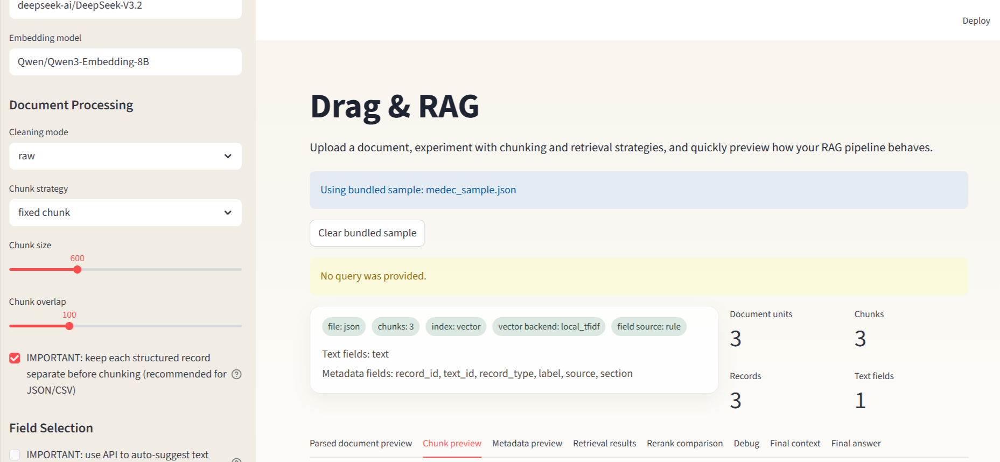

# Drag & RAG

A small local-first Streamlit app for quickly exploring RAG configs on your own files.

Open this [app](https://ragpreview-apnjpxmczsssbsyxlkhiyq.streamlit.app/) and everything there
Use it to upload a document, try different chunking and retrieval settings, inspect chunks / metadata / retrieval results, and see how the pipeline behaves before building anything more serious.



## What It Is

This is a simple personal workbench / author demo.

- Upload a file or use one of the bundled sample files
- Explore different RAG configurations visually
- Preview parsed records, chunks, metadata, retrieval results, rerank output, and final context
- Use an API key if you want the app to auto-suggest metadata fields for structured files

## Supported Files

- CSV
- JSON
- PDF

## API Note

An API key is optional for basic preview.

It is only needed for features like:
- automatic metadata suggestion
- query rewrite
- final answer generation
- optional API embeddings

For JSON and CSV, enabling auto metadata suggestion will send a preview of the file to the selected model so it can guess which fields are text fields and which ones should stay as metadata.

## Run

### Local

```bash
streamlit run app.py
```

### Docker

```bash
docker build -t rag-preview .
docker run -p 8501:8501 rag-preview
```
